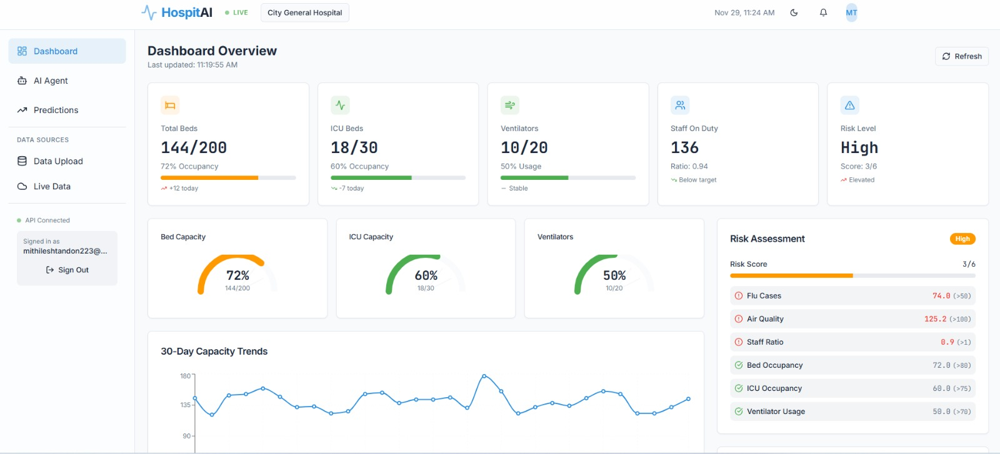

# HospitAI Dashboard



> **AI-powered hospital surge prediction system** that forecasts patient influx based on environmental factors and disease trends, enabling proactive healthcare capacity management.

## Problem Statement

Hospitals face critical challenges in predicting patient surges, leading to:
- Overcrowded emergency departments
- Insufficient bed availability
- Staff burnout from unpredictable demand
- Delayed patient care during crisis periods

**HospitAI solves this** by analyzing environmental data, disease trends, and capacity metrics to provide early warnings and actionable insights.

---

## Key Features

### Real-Time Monitoring
- **Live Dashboard** with capacity gauges and trend visualization
- **Environmental Tracking** (pollution, temperature, humidity)
- **Disease Surveillance** (flu cases, outbreak detection)
- **Capacity Metrics** (bed occupancy, ICU availability, ventilator usage)

### AI-Powered Intelligence
- **Autonomous AI Agent** using ReAct architecture for decision-making
- **ML-Based Predictions** with confidence intervals
- **Rule-Based Alerts** for critical threshold breaches
- **Proactive Recommendations** with approve/reject workflow

### Data Integration
- **CSV/Excel Upload** for real hospital data
- **Live Weather & AQI APIs** for environmental monitoring
- **Auto-Generation** of missing data columns with realistic defaults

---

## System Architecture

```
┌─────────────────┐     ┌──────────────────┐     ┌─────────────────┐
│  React Frontend │────▶│  FastAPI Backend │────▶│  AI Agent Core  │
│   (TypeScript)  │     │     (Python)     │     │   (Gemini AI)   │
└─────────────────┘     └──────────────────┘     └─────────────────┘
        │                        │                         │
        │                        ▼                         ▼
        │               ┌──────────────────┐     ┌─────────────────┐
        └──────────────▶│  Data Pipeline   │────▶│  ML Predictor   │
                        │  (Pandas/NumPy)  │     │  (Scikit-learn) │
                        └──────────────────┘     └─────────────────┘
```

### Project Structure
```
HospitAI/
├── backend/                    # Python backend services
│   ├── api.py                  # FastAPI REST endpoints
│   ├── ai_agent.py             # Autonomous agent system
│   ├── predictor_ml.py         # Machine learning models
│   ├── predictor_rulebased.py  # Rule-based surge detection
│   ├── data_generator.py       # Data simulation engine
│   ├── real_data_api.py        # Weather/AQI integration
│   ├── gpt_module.py           # Gemini AI integration
│   └── requirements.txt
│
├── frontend/                   # React application
│   ├── src/
│   │   ├── pages/              # Dashboard, AI Agent, Predictions
│   │   ├── components/         # Reusable UI components
│   │   ├── hooks/              # React Query API hooks
│   │   └── lib/                # API services
│   └── package.json
│
└── README.md
```

---

## Installation Guide

### Prerequisites
- **Python 3.10+** with pip
- **Node.js 18+** with npm
- API keys (optional): OpenWeather, Google Gemini

### Step 1: Backend Setup
```bash
cd backend

# Install dependencies
pip install -r requirements.txt

# Configure environment (optional)
cp .env.example .env
# Add API keys to .env:
# OPENWEATHER_API_KEY=your_key
# GEMINI_API_KEY=your_key
```

### Step 2: Frontend Setup
```bash
cd frontend

# Install dependencies
npm install

# Configure API endpoint
echo "VITE_API_URL=http://localhost:8000" > .env
```

---

## Running the Application

### Option 1: Development Mode

**Terminal 1 - Start Backend:**
```bash
cd backend
python -m uvicorn api:app --reload --port 8000
```

**Terminal 2 - Start Frontend:**
```bash
cd frontend
npm run dev
```

### Access Points
- **Dashboard**: http://localhost:8080
- **API Docs**: http://localhost:8000/docs
- **Health Check**: http://localhost:8000

---

## AI Agent System

The autonomous agent follows a **ReAct (Reasoning + Acting)** loop:

### 1. PERCEIVE
Collects real-time data:
- Current bed occupancy and ICU status
- Environmental conditions (AQI, temperature)
- Disease trends and outbreak signals
- Staff availability ratios

### 2. REASON
Analyzes patterns using:
- Rule-based threshold monitoring
- ML prediction models
- Historical trend analysis
- Google Gemini AI reasoning

### 3. PLAN
Generates prioritized actions:
- Resource allocation recommendations
- Staff scheduling adjustments
- Early discharge protocols
- Emergency capacity expansion

### 4. EXECUTE
Action workflow:
- **Auto-execute**: Safe, low-risk actions
- **Human approval**: Critical decisions requiring oversight
- **Logging**: All actions tracked for audit

---

## Critical Thresholds

| Metric | Warning Level | Critical Level |
|--------|--------------|----------------|
| **Bed Occupancy** | 75% | 90% |
| **ICU Occupancy** | 70% | 85% |
| **Ventilator Usage** | 60% | 80% |
| **Staff-to-Patient Ratio** | - | < 0.15 |
| **Air Quality Index (AQI)** | 100 | 150 |

---

## API Reference

### Core Endpoints

| Method | Endpoint | Description |
|--------|----------|-------------|
| `GET` | `/api/dashboard/summary` | Complete dashboard data |
| `GET` | `/api/dashboard/trends` | Historical trend analysis |
| `GET` | `/api/predictions` | ML-based surge forecasts |
| `POST` | `/api/agent/run` | Trigger AI agent analysis |
| `POST` | `/api/agent/approve/{id}` | Approve pending action |
| `GET` | `/api/alerts` | Active system alerts |
| `POST` | `/api/upload` | Upload CSV/Excel data |
| `GET` | `/api/live-data` | Live weather & AQI data |

### Data Upload Format

**Required columns:**
- `date` - Timestamp or date string
- `occupied_beds` - Number of occupied beds
- `total_beds` - Total bed capacity

**Optional columns:**
- `occupied_icu`, `flu_cases`, `temperature`, `pollution`
- Missing columns are auto-generated with realistic defaults

---

## Technology Stack

### Backend
- **FastAPI** - High-performance async API framework
- **Pandas & NumPy** - Data processing and analysis
- **Scikit-learn** - Machine learning models
- **Google Gemini AI** - Advanced reasoning and insights

### Frontend
- **React 18 + TypeScript** - Type-safe UI development
- **Vite** - Fast build tooling
- **Tailwind CSS** - Utility-first styling
- **Shadcn/ui** - Accessible component library
- **Recharts** - Data visualization
- **React Query** - Server state management

---

## Future Enhancements

- Multi-hospital network coordination
- Integration with hospital EHR systems
- Mobile app for on-call staff
- Predictive analytics for specific diseases
- Real-time ambulance routing optimization

---

## License

MIT License - Open source for healthcare innovation

---

## Contributing

Built for **Mumbai Hacks**. Contributions welcome via pull requests.

**Contact**: For questions or collaboration opportunities, please open an issue on GitHub.
